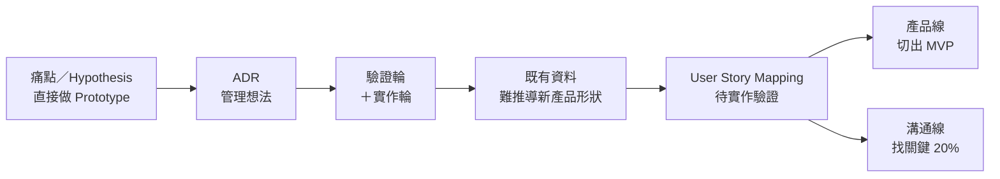
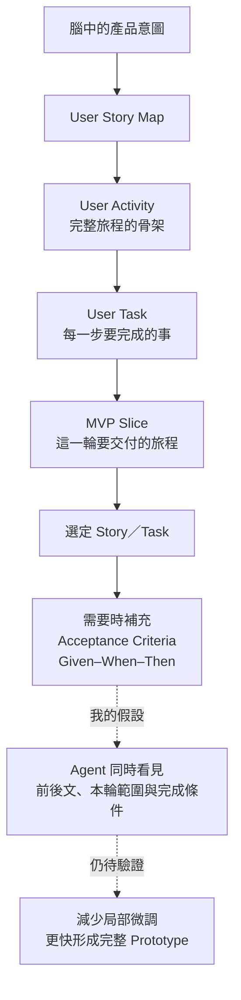

# 我怎麼走到 User Story Map

> 這份 Mental Map 要把我這三週的思考歷程攤開：我最初怎麼做、每一套方法遇到什麼問題、那些問題如何改變我的判斷，最後為什麼走到現在準備嘗試 User Story Map；同時保留這個新解法仍未被證明的地方。

這不是一套已完成的 AI-native 0→1 方法論，也不是要證明 User Story Map 一定有效。它比較像是一份思考紀錄：我如何從「想趕快把產品做出來」，一步一步發現真正卡住的地方，並走到現在的新嘗試。

## 先看整段路

這張圖只標示我走過的五段方法演變，以及目前分成產品實作與主管溝通的兩條下一步。真正重要的不是方法名稱，而是每一次卡關後，我對問題的理解發生了什麼改變。

## 起點：我想做的不是另一個金融資訊 App

我想從 0 到 1 做出一種不同的資訊產品。

目前多數金融產品都是讓使用者自己決定要看什麼資料，再根據資料做出投資判斷。這對已經有經驗的人或許可行，但對不知道該看什麼、也不知道如何解讀資訊的人，產品其實沒有真正承接住他們。

我想像的產品會反過來：它主動整理並呈現資訊，讓使用者能在短時間內形成對市場與投資標的的判斷。這個企圖很大，但產品到底應該長什麼樣、完整體驗如何串起來，我一開始其實還沒有想清楚。

當時我比較清楚的是「我希望它帶來什麼感受」，而不是「使用者會怎麼一步一步走完這個產品」。

## 第一段：從痛點直接走向 Hypothesis 與 Prototype

我最早的工作方式，是從既有的使用者回饋中找痛點，形成一個 Hypothesis，然後盡快把它做成 Prototype。

這個做法背後的直覺是：與其停留在抽象討論，不如趕快把想法做出來，再看它是否可行。問題是，我當時把幾個不同問題混在了一起：

- 使用者反映的現象，是否真的是值得解決的核心痛點？
- 我提出的解法，是否真的能解決這個痛點？
- 這個解法能不能被做成一個可操作的產品功能？

我常常還沒驗證第一個問題，就直接把痛點當成 Hypothesis，進入解法與 Prototype。後來我才開始意識到，我可能跳過了 Problem Framing：我還沒有先講清楚「真正的問題到底是什麼」，就已經開始解決它。

這是我的第一次判斷轉變：

> **能提出一個 Feature，不代表我已經定義清楚問題；能把 Feature 做出來，也不代表它真的在解決使用者痛點。**

## 第二段：我嘗試用 ADR 留住變動中的想法

在更早期的探索中，我也試過用 ADR 類型的文件與資料夾結構，保存我想到的 Feature、需求與產品想法。

我當時希望建立一個地方，把腦中覺得有價值的想法鎖住，避免探索過程中遺失。但實際上，這些內容仍在快速變動：痛點會改、Hypothesis 會改、Feature 也會改，連文件本身都需要不斷重寫。

這讓我發現，問題不只是「想法沒有被記錄」，而是我還沒有一套方式處理正在變動的產品理解。偏向記錄穩定決定的文件，並不能替我完成前面的探索。

我因此不再把資料夾結構或文件格式本身，當成能讓產品自然收斂的方法。

## 第三段：Validation Wheel 與 Implementation Wheel

後來我用「兩個輪子」理解產品開發。

第一個是 Validation Wheel。我會從目標使用者、可能的痛點、解決方式一路討論到 Feature，確認概念在邏輯上是否可行。第二個是 Implementation Wheel：把通過概念討論的 Feature 做成 Prototype，再從實際呈現中調整。

這套做法比「想到就做」多了一層思考，卻仍然沒有解決核心問題。

在 Validation Wheel 裡，Feature 可以被討論得很有道理；但一進入 Implementation Wheel，我就需要做大量微調。畫面要呈現什麼、資訊如何排序、使用者怎麼來到這裡、前後頁面如何銜接，都還要在實作時重新想一次。

最後，我只做出了單一情境中的局部體驗。它或許能讓人看到某種呈現方式，卻還不是一段完整的產品旅程。

這是第二次判斷轉變：

> **概念上說得通，不代表產品已經被想清楚。從 Feature 直接跳到 Prototype，中間仍然缺少一層。**

## 第四段：既有資料能支持問題，卻不能替我決定產品形狀

因為我需要向決策者說明方向，我也曾希望從既有產品的使用者資料中找到佐證。

這些資料確實能幫我描述現況。例如，外部市場量體與內部產品使用量體之間可能存在落差，因此我可以提出：「是不是有一群人，尚未被現有產品承接？」

但這個比較有明確邊界。它不能直接證明落差中的所有人都是潛在使用者，也不能告訴我這些人的痛點是什麼，更不能從一個既有 App 的使用行為，推導出另一個新 App 應該長什麼樣。

這是第三次判斷轉變：

> **資料可以幫我把問題問得更精準，但不能直接替我生成一個 0→1 產品。**

我仍然需要接觸真實使用者，也需要讓他們與 Prototype 互動。只是研究、問卷與 Prototype 之間存在時間上的取捨：如果前期研究耗時太久，我無法快速讓決策者看見產品；但如果 Prototype 太粗糙，測試者可能又感受不到我真正想驗證的價值。

這個拉扯到現在還沒有完全解開。

## 第五段：Prototype 的反覆失準，讓問題變得具體

真正讓我重新思考工作方式的，是 Prototype 迭代速度。

其中一個核心頁面前後做了多個版本。我不斷下 Prompt 微調資訊、互動與畫面，但每一次都像是在校準局部結果。Agent 可以完成我當下說出的 Task，卻不一定知道這個頁面在完整產品裡扮演什麼角色。

不同視角的回饋，也讓缺口更明顯：

- 有人追問完整 User Journey：使用者怎麼一步一步來到核心體驗？為什麼直接從某個局部頁面開始？
- 有人追問需求是否存在：如果還不知道尚未被承接的人真正痛在哪裡，產品存在的理由是什麼？
- 有人關心 Prototype 是否足夠真實：如果資訊與互動不像真的產品，決策者很難立即感受到它的價值。

這些回饋不是三個可以依序解完的階段，而是同時存在的要求。我一方面仍在探索未知產品，一方面要讓 Agent 得到更清楚的產品意圖，同時還要在短期交付中，讓決策者看見產品價值與我的調整。

我原本把問題理解成「Claude Code 做不出我想要的 Prototype」。現在我的理解開始改變：

> **也許不只是 Agent 的生成能力不夠，而是我把還在腦中的產品意圖，直接變成局部 Prompt，跳過了完整旅程與本輪範圍。**

## 最近的轉折：朋友提到 User Story Map

User Story Map 不是我一開始就知道、只是一直沒有採用的方法。它是在我卡關一段時間後，最近才被朋友提點的。

朋友提供的切入點是：先把產品的核心流程攤開成 User Activity，再往下拆成 User Task；接著不是一次把全部做完，而是選出一條仍保有核心價值的 MVP Slice，逐步實作與迭代。

這讓我第一次看到，從產品意圖走到 Agent Task 之間，可能存在一個我一直缺少的中間結構。

我現在不是把 User Story Map 當成整套 AI-native 0→1 框架。它在我心中的位置比較明確：

> **它可能是一個向 Agent 交付產品意圖的切入工具。**

它不會替我決定目標使用者、證明痛點存在，也不會自動告訴我產品應該長什麼樣。它可能做的是：把我已經想到的完整旅程、使用者每一步要完成的事，以及這一輪真正要實作的範圍，放進同一張可理解的結構裡。

核心不是規格越多越好，而是 Agent 不應只看到孤立的 Task。

## 為什麼我認為它可能有效

我目前的推論是：

1. 過去我常從 Feature、User Story 或局部 Prompt 直接進入實作。
2. Agent 得到的是「這一頁要做什麼」，卻不一定知道「使用者為什麼來到這裡」以及「完成後要去哪裡」。
3. User Story Map 可能先攤開完整 User Journey，再切出本輪 MVP，而不是先把一個頁面寫得非常詳細。
4. 因此，每個被交付的 Task 可能同時帶有產品前後文與範圍邊界。
5. 我推測這能減少 Agent 對局部畫面的自行猜測，也減少我事後用大量 Prompt 校準。

但這只是基於過去失敗經驗形成的解法假設，不是已經驗證的結果。

## 目前仍然不確定的地方

### 1. 產品本身仍未被證明

我還不能確定尚未被現有產品承接的人，是否真的有我想像中的痛點；目標使用者是誰、產品的完整形狀是什麼，也仍在探索。

### 2. User Story Map 是否適合高度未知的 0→1

它可能很適合整理已經相對清楚的產品，但面對仍在變動的 TA、痛點與產品形狀時，會不會太早把探索固定下來，我還不知道。

### 3. 它是否真的能改善 Agent 協作

我還沒有實作，因此不能說它會讓 Agent 更理解產品意圖、減少 Prompt 微調，或加快 Prototype。這些都是下一步要觀察的結果。

### 4. 拆解要到多細

User Activity、User Task、Story、Acceptance Criteria 與 Given–When–Then 並不是越完整越好。我還需要找到足以讓 Agent 理解、又不會拖慢探索的尺度。

### 5. Prototype 到底在驗證什麼

即使測試者能操作 Prototype，也要分清楚：他們理解了產品，不代表痛點已被證明；他們喜歡畫面，也不代表已經達到 Product–Market Fit。

## 我目前真正走到的位置

我還沒有建立一套 AI-native 0→1 開發框架。

我現在只是比三週前更清楚地看到：Prototype 反覆失準，可能不是單純的生成能力問題。我可能缺少一個能把產品意圖、完整旅程與 MVP 範圍交付給 Agent 的中間結構。

朋友最近提出的 User Story Map，讓我看到一個可能的切入工具。但我還沒有開始實作，也不知道它是否真的有效。

這就是目前的終點，也是下一步的起點。
