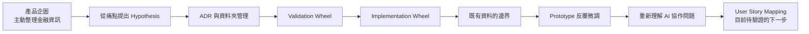
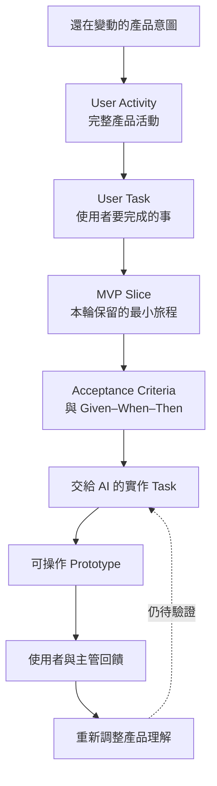

# 我怎麼從局部 Prototype 走向 AI-native 的 0→1 產品探索

> 這是一份第一人稱的思考紀錄，整理我在 CMoney 探索新金融產品時，如何從「趕快做出 Prototype」開始，經歷多種方法與卡點，最後走到 User Story Mapping 的下一個嘗試。
>
> 這不是一套已經被證明有效的 AI-native 0→1 方法論，也不是在宣稱產品方向已經成立。它記錄的是：我當時怎麼判斷、後來哪裡發現不對，以及目前還不知道什麼。

## 先說我現在站在哪裡

我目前在 CMoney 內部探索一個新的金融產品，希望改變現有金融產品讓使用者「自己選資料、自己解讀」的呈現方式。

我的初步想像是，利用 CMoney 已經成熟的資訊取得能力，做出一個會主動整理並推送資訊的 App。使用者不需要先知道應該看什麼資料，打開產品後，就能在短時間內對個股、ETF 或大盤形成初步判斷。

這個方向是我目前的產品企圖，但它還不是已被驗證的產品定位。我還不知道：

- 真正尚未被現有產品承接的人是誰。
- 他們是否真的有我想像中的痛點。
- 他們需要的完整產品體驗是什麼。
- 主動整理資訊是否真的能幫助他們形成判斷。

我一開始以為自己最需要的是更快把想法做成 Prototype。後來我逐漸發現，真正卡住我的可能不是生成速度，而是我還沒有把產品意圖、完整旅程與本輪範圍說清楚，就直接把局部工作交給 AI。

## 第一段：我先從痛點提出 Hypothesis

我最早的開發方式，是從使用者回饋中找痛點，再提出一個 Hypothesis，然後盡快把它做成 Prototype。

這些痛點有一部分來自新網銀內部客服 Excel 的使用者回饋。我也嘗試用「峰值體驗」的方式整理這些回饋，希望找出使用者在某些時刻遇到的困難。

當時我的直覺是，只要能找到一個痛點，就可以開始想解法，再把解法做成產品。

但後來我才發現，我把幾個不同層次的問題疊在一起：

1. 這個現象到底是不是值得解決的使用者痛點？
2. 如果是痛點，什麼方式可能解決它？
3. 這個解法能不能被做成一個可操作的功能？
4. 這個功能放進完整產品後，是否真的能帶來價值？

我當時常常還沒有先驗證第一個問題，就直接把我看到的問題當成 Hypothesis，進入驗證與實作。

這是我第一次重要的判斷轉變：

> 我以為自己是在驗證解法，後來才發現，我甚至還沒有完成問題定義。

也就是說，我應該先分開「這到底是不是痛點」與「這個功能能不能做出來」。前者是 Problem Framing，後者才是 Problem Solving 與產品實作。

## 第二段：我嘗試用 ADR 和資料夾把想法鎖住

在更早期的探索裡，我使用過 Google ADR，也大量依賴資料夾結構管理產品想法。

我原本以為，只要把覺得有價值的 Feature、需求與想法記錄下來，就能避免探索過程中遺失，並讓產品逐步收斂。

但實際上，我記錄下來的內容仍然在快速變動：

- 痛點會改變。
- Hypothesis 會改變。
- Feature 會改變。
- 我對產品形狀的理解也會改變。

我後來才理解，ADR 比較適合保存相對穩定的決定，而不是承接一個還在大量變動中的探索過程。

資料夾可以幫我保存內容，但不能代替我完成判斷。文件可以讓想法留下來，卻不能自動告訴我哪一個問題最重要、哪一段旅程應該先做。

這是第二個判斷轉變：

> 我缺少的不是更多文件，而是一個能處理產品理解持續變動的探索方式。

## 第三段：我改用 Validation Wheel 和 Implementation Wheel

後來我用「兩個輪子」來理解產品開發。

### Validation Wheel

Validation Wheel 的目標，是快速討論產品願景是否可行。我會把願景往下拆成需求或 Feature，再討論這個 Feature 是否合理、是否值得做。

當時我希望做出的金融 App 看起來要非常不一樣，最好讓人一看就覺得震撼。因此，我在拆解過程中很容易停在 Feature 層次：

> 這個功能很有吸引力，也許可以讓產品跟現有金融 App 不一樣。

討論概念時，這個方法看起來運作得很順利。Feature 可以被說得合理，願景也可以被描述得很有吸引力。

### Implementation Wheel

概念討論完成後，我會進入 Implementation Wheel，把 Feature 做成 Prototype，再看實際畫面與互動。

問題是在概念階段看起來沒有矛盾的東西，進到 Prototype 後，會立刻出現很多新的問題：

- 使用者怎麼進入這個功能？
- 這個頁面前面是什麼？
- 使用者看完之後要去哪裡？
- 資訊應該如何排序？
- 哪些內容要先出現？
- 這個互動是產品核心，還是只是畫面效果？

最後，我只做出個股的滑動式、Reels-like 體驗，讓使用者可以快速吸收資訊。

這個局部體驗不是沒有價值。它讓我看到「主動整理並呈現資訊」可能長什麼樣子，也證明我可以透過反覆調整做出接近預期的頁面。

但它沒有證明：

- 完整產品旅程已經被想清楚。
- 這個局部體驗能自然延伸成整個 App。
- Feature 被認為合理，就代表產品已經成立。

這是第三個判斷轉變：

> 概念上說得通，不代表產品已經被想清楚；從 Feature 直接跳到 Prototype，中間仍然缺少一層完整的產品結構。

## 第四段：我試著用既有資料支持新產品方向

因為我需要向主管說明產品方向，我也嘗試從 CMoney 既有產品資料中尋找佐證。

我曾經用一個「市場交易人數與公司金融產品 MAU 之間存在落差」的問題來思考：

- 分母：整個股市的總交易人數。
- 分子：公司所有金融產品去重後的月活躍用戶量。
- 我當時以約 30% 與 70% 的落差來描述問題。

這個數字 framing 能幫我提出一個重要問題：

> 如果市場上仍有一大部分交易者沒有使用我們的金融產品，他們為什麼沒有被承接？

但這只能幫助我把問題問得更精準，不能直接證明剩下的人都是潛在使用者，也不能直接告訴我他們的痛點，更不能從既有 App 的使用資料推導出另一個新 App 應該長什麼樣子。

我在這裡遇到一個很重要的資料邊界：

> 一個 App 的使用者資料，可以幫助我理解現況，但不能直接生成另一個 App 的產品形狀。

這也代表 30%／70% 的說法仍需要確認母體、統計期間、去重方式與實際資料來源。我不能把它直接寫成市場覆蓋率，更不能把它直接當成產品需求已被證明。

資料可以支持問題存在的可能性，但不能代替真實使用者研究，也不能代替 Prototype 測試。

## 第五段：Prototype 反覆失準，讓問題變得具體

我和 Claude Code 互動時，最明顯的卡點是某個主動呈現資訊的產品頁面。

在語音輸入裡，我曾把它說成「客服頁」，但依照前後文，我比較可能是在描述個股頁；這個名稱本身仍有轉錄不確定性。可以確定的是，這個頁面前後做了五個版本，中間需要不斷下 Prompt 微調資訊、互動與畫面。

我一開始把這個問題理解成：

> Claude Code 不夠理解我想要的 Prototype，所以需要我多下幾個 Prompt。

但後來我開始懷疑，問題不是單純的生成能力，而是我交付給 AI 的資訊不完整。

我只把一個局部 User Story 或頁面需求交給 AI，卻沒有先清楚說明：

- 完整 User Flow 是什麼。
- 使用者怎麼進入這個頁面。
- 這個頁面在完整產品裡扮演什麼角色。
- 使用者完成這一步後要去哪裡。
- 這一輪到底要完成哪些活動與任務。
- 哪些東西可以延後。
- 什麼程度才算完成。

我後來想到，Scrum 裡的 User Story 或 Item，本來就不應該直接等同於可以實作的 Task。它可能還需要拆成更詳細的 Task，並補上：

- Acceptance Criteria。
- Given–When–Then 的場景描述。
- 與利害關係人之間的確認與調整。

而我當時很可能在 User Story 層次，就直接讓 Claude Code 開始實作。

這讓我重新理解了 Prompt 微調的本質。

我不是單純在調整畫面，而是在事後補回原本沒有先做好的產品決定。AI 只能根據它看到的局部資訊完成 Task；當產品前後文沒有被交付時，它就必須自行猜測。

## 第六段：我開始分辨 0→1 與既有產品開發的差異

這週我開始把基於 Scrum 的 Agile 開發方式，帶進我對 Lean Agile 領導力的探索。

在和 COO Jack 開會、接受檢查的過程中，我注意到 Prototype 迭代速度真的太慢。但我也發現，這不一定能靠幾個更好的 Prompt 解決。

我開始把既有產品開發和 0→1 探索分開看。

既有產品通常已經知道：

- 使用者活動是什麼。
- User Journey 怎麼走。
- 有哪些功能。
- 功能彼此如何互動。
- 按鈕應該怎麼運作。
- 這一輪要交付什麼。

因此，當 AI 被交付一個清楚的 Task 時，它比較像是在解一個已經定義好的問題。

但我現在做的是一個還沒有被證明的產品。目標客群、痛點、產品形狀與完整流程都仍在探索。這兩種工作的表面上都叫做「開發」，但我目前感覺它們需要不同的協作方式。

我的新判斷是：

> 0→1 的問題，不只是如何讓 AI 更快完成 Task，而是如何先把仍然模糊的產品意圖整理成 AI 能理解、又不會過早鎖死探索的結構。

## 第七段：我重新理解主管真正要看的交付物

我後來發現，這個問題不只涉及產品，也涉及我作為開發負責人，如何向主管呈現進度。

我需要同時處理兩個層面：

1. 產品本身如何逐步形成。
2. 我如何在下一次報告時，讓主管看見我已經修正了問題。

後者對目前的工作尤其重要。

我開始用「20% 的關鍵資訊撬動 80% 的進度」來整理交付策略。我的目標不是在七天內做出和市面上成熟產品一樣完整的 App，而是讓主管用很短的時間就能看懂：

- 產品和現有金融產品有什麼不同。
- 使用者如何走完核心 User Journey。
- 主動呈現資訊的核心價值在哪裡。
- 我如何從過去的失準中調整開發方法。
- 哪些地方已經有證據，哪些仍然是假設。

我目前認為最重要的 20% 交付物包含兩部分。

### 一條完整的核心 Prototype Journey

Prototype 不一定要功能完備，但必須讓主管可以實際操作一條核心路徑。

他應該能看見：

- 使用者如何進入產品。
- 使用者如何接觸市場、ETF 或個股資訊。
- 資訊如何被主動整理。
- 使用者如何從資訊形成初步判斷。
- 這個體驗和既有產品有什麼不同。

如果只是做出一個漂亮的局部個股頁，主管可能看見畫面，但不一定看見產品。

### 一套能說清楚的思路與證據

我也需要說清楚：

- 我看到的問題是什麼。
- 哪些資料只能描述現況。
- 哪些地方仍然缺乏真實使用者證據。
- 為什麼先做 Prototype，而不是先花三天跑完問卷。
- 我準備如何透過 Prototype 與使用者互動來驗證。

我曾經想過要做數據分析與問卷，但問卷設計、內部流程與執行都需要時間。對目前的進度來說，我傾向先在三天內做出一個相對成熟的 Prototype，再讓使用者互動。

這不是因為問卷沒有價值，而是目前的時間限制讓我必須做取捨。

我也需要承認，這個取捨帶有直覺與 Guess-feeling 的成分。Prototype 測試可能比等待一份幫助有限的資料更接近產品驗證，但前提是 Prototype 不能粗糙到讓測試者只是在評價畫面，而無法感受真正想驗證的價值。

## 第八段：不同主管看的是不同問題

我對 Mental Map 的另一個新理解，是不同角色的主管會從不同角度挑戰我。

### 資深 PM 看完整 User Journey

他會問：

- 使用者是怎麼一步一步來到這裡的？
- 為什麼一開始就直接做個股頁？
- 前面銜接的市場、ETF 或入口在哪裡？
- 使用者看完這個頁面後要去哪裡？

這反映的是產品全貌與流程完整性。

### 小主管看產品是否有存在理由

他會問：

- 潛在使用者真的存在嗎？
- 如果剩下的交易者沒有被現有產品承接，他們的痛點是什麼？
- 如果連痛點都不知道，這個產品為什麼需要存在？

這反映的是問題定義與需求證據。

### 高階主管看能不能立刻感受到產品價值

他會關心：

- Prototype 是否能被實際操作。
- UX 是否足夠直觀。
- 是否使用真實股價資訊。
- 使用者能不能很快理解產品想表達的重點。

但回到我的工作現實，這份成果最終是要呈現給最高階主管看的。因此，我需要把三種視角整合成一個 20% 的核心交付，而不是分別做出三套互不相連的材料。

我曾經用 Data Team 的商業情境來理解這件事：如果對方的技術實力比我們強很多，我們不可能和對方競爭資料研究的深度；真正重要的是找出對方最在意的那 20%，精準讓對方看見價值。

這個比喻目前對我而言是一個溝通策略，不是產品價值已被證明的證據。

## 第九段：朋友讓我看到 User Story Mapping

在我卡住一段時間後，一位在 Atlassian 台灣官方代理商工作的朋友，提供了一個重要的切入點。

他提到，通常可以先列出 User Activity。對我而言，User Activity 比較接近產品的核心流程或完整 User Journey。

接著再把每個 User Activity 拆成 User Task，最後從完整活動與任務中切出可迭代的 MVP。

這個想法讓我看到，從產品意圖到 AI 實作 Task 之間，可能存在一個我過去缺少的中間層：

1. 先列出使用者主要會完成哪些活動。
2. 再把每個活動拆成使用者需要完成的任務。
3. 從完整旅程中選出本輪真正要做的 MVP Slice。
4. 對選定的 Task 補上最低必要的驗收條件。
5. 再把範圍清楚的 Task 交給 AI 實作。
6. 透過 Prototype 與真實使用者互動，觀察產品是否真的承接住問題。

我現在不把 User Story Mapping 當成完整的 AI-native 0→1 框架。

它不能替我決定：

- 目標使用者是誰。
- 痛點是否真的存在。
- 產品是否值得做。
- 完整產品應該長什麼樣子。
- Product–Market Fit 是否已經成立。

它目前比較像是一個工作假設：

> 如果我先把完整 User Activity、User Task 與本輪 MVP 放在同一個結構裡，AI 可能就不必只從孤立頁面猜測整個產品。

## 我目前還不確定的事情

### 1. 產品痛點仍未被證明

30%／70% 的資料 framing 可以幫助我提出問題，但不能證明剩下的人都是潛在使用者，也不能證明他們有相同痛點。

### 2. User Story Mapping 是否適合高度未知的 0→1

它可能很適合整理已經清楚的產品，但如果 TA、痛點與產品形狀仍在變動，太早拆解可能會讓探索被固定下來。

### 3. 它是否真的能改善 AI 協作

我還沒有完成實作，因此不能宣稱它會：

- 讓 AI 更理解產品意圖。
- 減少第一版失準。
- 減少 Prompt 微調。
- 加快完整 Prototype 的產出。

這些都需要實際比較。

### 4. 拆解應該到多細

User Activity、User Task、Story、Acceptance Criteria 與 Given–When–Then 並不是越完整越好。

如果拆得太粗，AI 還是會自行猜測；如果拆得太細，探索速度可能更慢。我需要找到一個足以讓 AI 理解、但不會讓前期規格化拖慢探索的尺度。

### 5. Prototype 到底在驗證什麼

使用者能操作 Prototype，不代表痛點已經被證明。

使用者喜歡畫面，也不代表 Product–Market Fit 已經成立。

我需要把幾件事分開：

- 使用者是否理解產品。
- 使用者是否真的遇到這個問題。
- 產品是否提供有價值的解法。
- 使用者是否願意持續使用。
- 產品是否值得進一步投入。

## 我目前真正走到的位置

我還沒有建立一套已被證明有效的 AI-native 0→1 開發框架。

我現在只是比一開始更清楚地看到：

- 我曾經太快把痛點當成 Hypothesis。
- 我曾經把適合保存穩定決定的 ADR，拿來管理持續變動的探索。
- 我曾經用 Validation Wheel 驗證 Feature，卻沒有先攤開完整產品旅程。
- 我曾經用 Implementation Wheel 打磨局部 Prototype，卻沒有足夠的前後文。
- 既有產品資料可以幫助我描述現況，卻不能直接生成新 App 的產品形狀。
- AI 反覆失準，可能不是單純的模型能力問題，而是我沒有先把產品活動、任務、範圍與完成條件交付清楚。
- 面對主管時，我不能只交付一個局部畫面，而要用一條核心旅程與一套清楚的思路，讓對方快速理解產品價值。

User Story Mapping 是我現在準備嘗試的下一步。

我想先用一個有限範圍的核心旅程，驗證它是否能讓我更快切出 MVP、讓 AI 更少猜測、減少事後微調，並讓主管看見產品全貌。

但在這個實驗完成以前，我只能說它是合理的工作假設，不能說它已經是方法論，也不能說它已經解決了產品的問題。

這就是我目前的終點，也是下一步的起點。
