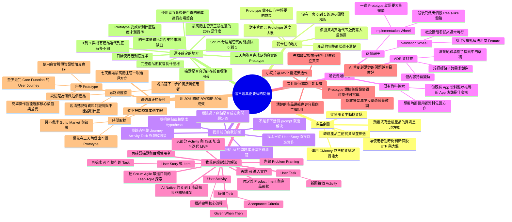
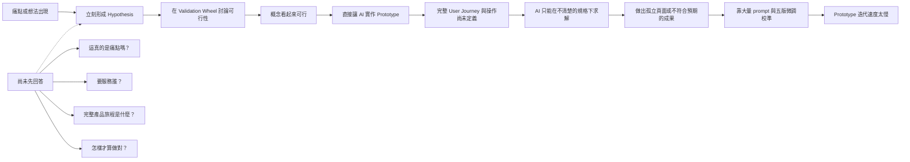
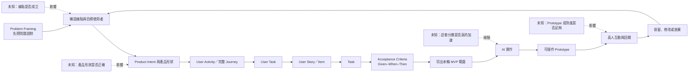
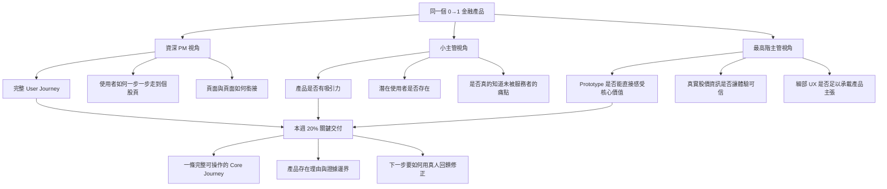

# 3 Week Mental Map

> 這三週，我不只是在做一個金融 App；我是在找一套方法，把模糊的 0→1 產品探索，逐層轉成 AI 能可靠執行的工作，同時讓主管看見產品與我的工作方式都已步入正軌。

這份圖優先還原我目前的思考，不把尚未確認的推測補成完整方法論。

## 我的整體 Mental Map

## 我認為問題是怎麼發生的

這張圖是我目前的初步判定：規格不清楚很可能是主要原因，但還不能把所有 Prototype 品質問題都歸因於它。

## 我現在想建立的新工作鏈

核心不是把 Scrum 名詞全部搬進來，而是**在 AI 實作之前，把產品思考逐層變成可執行、可驗收的小問題**。

## 橫向主題：不同主管其實在檢查不同東西

這不是產品開發流程中的下一步，而是一組同時存在的評估視角。

我的最終觀眾是最高階主管，但不能只做他提出的單點 UX 修改；我需要用一個完整 Prototype，把三種視角最關鍵的問題收進同一個可操作體驗。

## 目前的核心概念

1. **AI 的速度受限於問題清楚度。** 我目前懷疑，Prototype 慢不是單純的生成能力問題，而是我太早讓 AI 實作。
2. **0→1 要先探索，再規格化。** Scrum 可以承接已經被說清楚的工作，但不能代替目標使用者、痛點、產品價值與形狀的探索。
3. **完整不等於功能很多。** 本週要完整的是核心價值的使用者路徑，不是做出市面產品的所有功能。
4. **Prototype 不是驗證結果。** 它先把假設變成別人能操作、能挑戰的東西；真正的驗證來自目標使用者互動後的反應與行為。
5. **主管溝通也是要解的產品問題。** 本週不只要讓產品前進，也要讓主管在短時間看見方向、取捨、調整與下一步。
6. **先解痛點，再測是否契合市場。** 現階段不能先宣稱 Product-Market Fit；應先提出能解痛點的產品，再透過真人測試判斷是否成立。

## 數據邏輯的校準

目前的算法是：

- 分母：整體股市當月有交易的人數。
- 分子：CMoney 金融產品跨產品去重後的月活躍用戶量。
- 兩者相比：約為三成。

這個比值目前只能說明「兩個量體的相對大小」，**不能直接稱為覆蓋率，也不能推論剩下七成都是未被服務的潛在使用者**。原因是兩邊的身分是否重疊、口徑是否完全可比，以及七成人口的需求與痛點都還不知道。

因此，小主管提出的挑戰仍成立：這組數字可以用來提出問題，卻還不能單獨證明產品存在的必要性。要讓它變成更強的證據，仍需要：

1. 確認分子與分母的身分和統計口徑能否對齊。
2. 說清楚新產品真正想服務的是哪一群人，而不是把剩下七成全部當成目標。
3. 透過訪談、Prototype 測試或其他使用者證據，確認他們是否真的有「資訊太多、無法抓重點」的痛點。

## 本週的 Decision Lock

**本輪要決定：** 這套「先探索、再拆 Activity／Task／驗收場景、最後交給 AI 實作」的方法，能否在七天內產出一個完整且可供主管與使用者挑戰的 Core Journey Prototype。

**影響範圍：** 本週 Prototype 的工作方式與主管報告，不延伸到 Go-to-Market、正式部署或完整產品開發制度。

**必要證據：**

- Prototype 能從入口走完一條核心使用者路徑。
- 體驗中能看懂產品主動挑資訊、講重點的差異。
- 使用真實股價資訊，不只是抽象示意。
- 每個關鍵 Task 有可觀察的驗收條件。
- 至少能取得主管或目標使用者對核心假設的具體挑戰。

**停止條件：**

- 若三天內仍主要靠逐像素、逐文案 prompt 才能前進，先停止擴功能，檢查是不是上游 Journey、Task 或驗收條件仍不清楚。
- 若完整路徑做出來仍無法讓人說出產品價值，不以美化畫面掩蓋，回到目標使用者、痛點與 Product Intent。
- 若測試對象不是目標使用者，只把結果視為 Prototype 可理解性回饋，不宣稱痛點或 Product-Market Fit 已被驗證。

## 一句話收斂

**我這週要驗證的，不只是某個金融 App Prototype 能不能做出來，而是能否把 0→1 的模糊產品思考，轉成一條 AI 做得快、主管看得懂、使用者能實際挑戰的完整工作鏈。**
