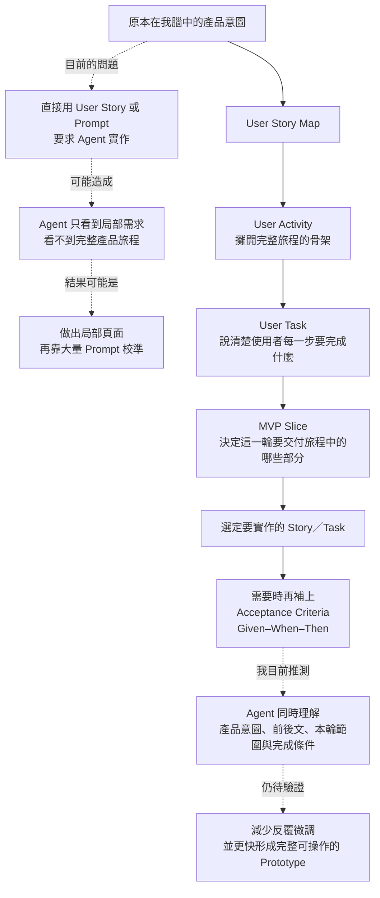
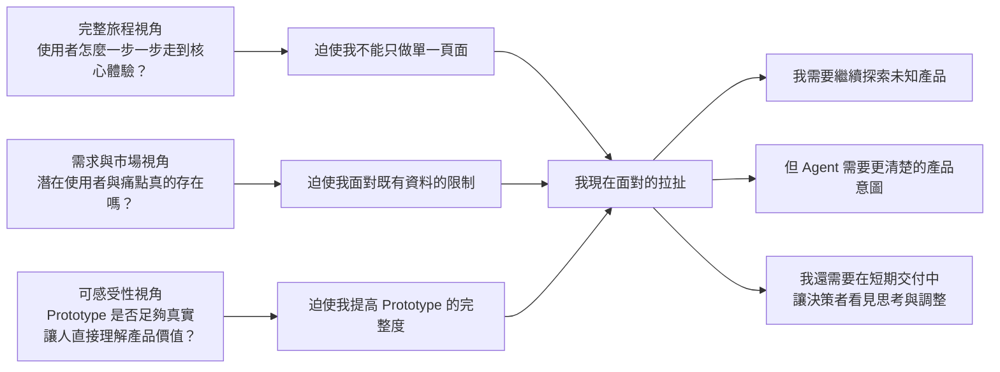
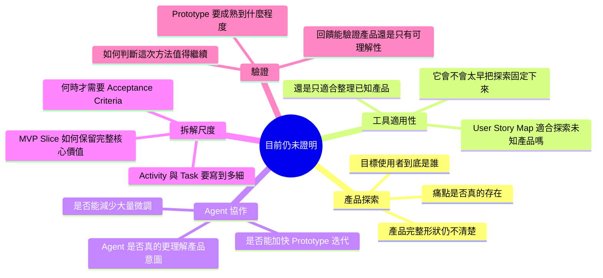

# 我怎麼走到 User Story Map

> 這張 Mental Map 要把我這三週的思考歷程攤開：我最初怎麼做、每一套方法遇到什麼問題、那些問題如何改變我的判斷，最後為什麼走到現在準備嘗試 User Story Map；同時保留這個新解法仍未被證明的地方。

這不是一套已完成的 AI-native 0→1 方法論，也不是要證明 User Story Map 一定有效。它只呈現我目前如何理解自己走過的路。

## 三週思考歷程

```mermaid
flowchart TB
    A["起點<br/>我想把一個新型資訊產品從 0 做到 1"] --> B["產品企圖很大<br/>讓產品主動整理資訊<br/>幫助使用者更快形成判斷"]

    B --> C["最初的工作方式<br/>從使用者痛點形成 Hypothesis<br/>再趕快做成 Prototype"]
    C --> D["我也嘗試用 ADR 保存<br/>想到的 Feature、需求與好點子"]

    D --> E["遇到的問題<br/>探索中的想法一直改變<br/>Hypothesis 不知道該怎麼驗證<br/>ADR 也跟著反覆調整"]
    E --> F["我的判斷開始改變<br/>我可能把痛點直接當成 Hypothesis<br/>跳過了『這是不是問題』的 Problem Framing"]

    F --> G["下一套做法<br/>Validation Wheel ＋ Implementation Wheel"]
    G --> H["Validation Wheel<br/>從 TA、痛點、解法走向 Feature<br/>先討論概念是否可行"]
    H --> I["Implementation Wheel<br/>把概念做成 Prototype"]

    I --> J["再次遇到問題<br/>概念階段看起來沒有問題<br/>一進 Prototype 就需要大量微調<br/>最後只形成單一情境的局部體驗"]
    J --> K["同時嘗試用既有資料佐證方向<br/>但既有產品資料能說明現況<br/>無法直接推導新產品應該長什麼樣"]

    K --> L["我的判斷再次改變<br/>Feature 在概念上可行<br/>不代表我已經想清楚完整產品<br/>資料佐證也不能替我決定產品形狀"]

    L --> M["卡關變得具體<br/>一個核心頁面反覆做了多個版本<br/>我持續用大量 Prompt 微調<br/>Prototype 迭代仍然太慢"]
    M --> N["外部回饋讓問題更明顯<br/>完整 User Journey 在哪裡？<br/>潛在使用者與痛點真的存在嗎？<br/>Prototype 能不能直接讓人感受價值？"]

    N --> O["我開始重新解釋問題<br/>可能不只是 AI 做不好<br/>而是我還沒有把產品意圖<br/>交付成 Agent 能理解的結構"]
    O --> P["我回頭看到自己跳過的中間層<br/>完整 User Journey<br/>User Activity<br/>User Task<br/>可迭代的 MVP 範圍"]

    P --> Q["最近的轉折<br/>朋友提點我可以使用<br/>User Story Map"]
    Q --> R["我目前的理解<br/>User Story Map 可能是一個切入工具<br/>把腦中的產品意圖攤開<br/>讓 Agent 理解完整旅程與本輪範圍"]

    R --> S["現在停在這裡<br/>我還沒有開始用它實作<br/>它是下一個準備嘗試的解法<br/>不是已被證明的答案"]
```

## 為什麼我現在想到 User Story Map

我不是把 User Story Map 當成整套 0→1 方法論，而是把它視為一個**向 Agent 交付產品意圖的切入工具**。

目前的核心概念不是「規格寫得越多越好」，而是：

> **我需要一種方式，把腦中的產品意圖、使用者走過的完整旅程，以及這一輪真正要做的範圍，同時交給 Agent。**

## 橫向主題：不同回饋如何推動我的思考

這些不是時間線上的獨立階段，而是三種同時存在的評估視角。

內外部量體的比較曾幫我提出「可能有一群人尚未被既有產品承接」的問題，但它只能描述兩個量體的差異，不能直接證明那些人都是潛在使用者，也不能告訴我新產品應該長什麼樣。

## User Story Map 仍未解開的問題

## 我目前真正走到的位置

我現在不是已經建立了一套 AI-native 0→1 開發框架，而是走到了一個新的問題理解：

> Prototype 反覆失準，可能不是單純的生成能力問題；我可能缺少一個能把產品意圖、完整旅程與 MVP 範圍交付給 Agent 的中間結構。朋友最近提出的 User Story Map，讓我第一次看到一個可能的切入工具，但我還沒有開始實作，也不知道它是否真的有效。

這就是目前的終點，也是下一步的起點。
