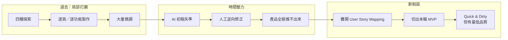

# 從局部 Prototype 到完整產品

> 這份文件整理我近期嘗試過的產品探索方式、實際碰到的限制，以及我為什麼準備用 User Story Mapping 改變與 AI 協作的方法。

## Executive Summary

我現在面對的核心問題，不只是 Prototype 做得不夠快，而是必須在短時間內，讓一個功能與資訊都非常多的金融 App 呈現出產品全貌，並至少走完一條能讓人理解核心價值的使用流程。

過去我曾成功打磨出一個[個股頁的呈現](https://williamchiu-eth.github.io/h8-stock-prototype-claude_design/?version=v5)，但它需要大量時間反覆調整，而且可能只占完整產品中的一小部分。這證明局部頁面可以被做好，卻沒有證明這套方式能快速延伸成完整產品。

目前最大的瓶頸，是我還沒有先把產品的整體使用流程攤開，就直接把局部功能交給 AI 實作。當 AI 第一版偏離我的意圖，我必須再用大量 Prompt 逆向修正。結果是單一頁面逐漸變好，但產品全貌推進得太慢。

我目前的新假設是：先用 User Story Mapping 攤開使用者活動與任務，再由我決定這一輪 MVP 要涵蓋哪些部分，可能可以讓 AI 看見前後文、範圍與完成條件，減少反覆修正。

這仍是一個待驗證的假設，不是已經成立的方法。

## 1. 我進行了哪些探索

這四種方式不一定是平行進行，也不是前一種完全結束後才進入下一種。它們曾經先後出現、部分重疊，但都只能從單一方向推進，沒有讓我快速看見並完成整體產品。

| 探索方式 | 當時的假設 | 原本希望得到什麼 | 實際結果 | 在時間壓力下的限制 |
|---|---|---|---|---|
| Hypothesis → Prototype | 趕快把想法做出來，就能確認方向是否可行 | 一個能驗證產品想法的 Prototype | 很快進入局部功能實作，但問題、解法與驗證方式仍混在一起 | 還沒看見完整流程，就開始打磨單一功能 |
| ADR 與資料夾 | 把 Feature、需求與想法記錄下來，可以幫助產品逐步收斂 | 一套能保存並推進產品決定的結構 | 保存了想法，但探索中的內容持續變動 | 文件能留住決定，卻不能告訴我短時間內應先完成哪些部分 |
| 驗證輪＋實作輪 | 先確認 Feature，再交給 AI 製作，可以減少錯誤 | 概念合理、實作也接近預期的 Prototype | Feature 在概念上說得通，進入實作後仍需要大量微調 | 可以逐頁完善，但速度不足以快速推進產品全貌 |
| 既有資料探索 | 既有產品資料可以支持新產品方向 | 找到潛在需求，並推導新產品應該處理的問題 | 資料能描述既有使用情況，卻不能直接告訴我新產品應該長什麼樣 | 資料可以幫助提問，但不能直接形成完整產品架構 |

這些探索並不是沒有價值。它們可以幫助我慢慢把一個頁面或功能做好，也讓我逐步看見問題發生在哪裡。

但目前真正的限制是：我沒有足夠時間用相同方式，把所有頁面一個個打磨完成。

## 2. 為什麼目前的方法太慢

目前的 AI 協作流程大致是：

1. 我先提出一個局部功能或頁面需求。
2. AI 根據有限的內容生成第一版。
3. AI 不知道這個頁面位於完整產品的哪個位置，也不知道前後要接什麼。
4. 它只能自行補上缺少的產品決定。
5. 生成結果偏離我的意圖後，我再透過 Prompt 一項一項修正。
6. 大量時間花在救回單一頁面，整體產品仍沒有被攤開。

因此，問題不只是 AI 第一版的品質不好。

更大的問題是：我把還沒有被完整定義的產品，直接變成局部 Task 交給 AI。AI 生成出偏離意圖的結果後，我只能從既有產物反推它做了哪些假設，再慢慢改回來。

### 個股頁的呈現暴露了什麼

目前的個股頁已經被打磨到一定程度，能呈現主動整理資訊的局部體驗。

但它可能只是 User Story Mapping 裡的一個小項目。完整金融產品還可能包含使用者如何進入、如何選擇市場或標的、如何取得資訊、如何理解資訊、如何形成判斷，以及後續如何繼續使用。

這些完整活動目前尚未被清楚攤開，我也不能先假設已經知道完整的 User Journey。

個股頁證明的是：

- 透過大量微調，局部體驗可以被做好。
- AI 能在持續校準後產出接近預期的頁面。

它沒有證明的是：

- 相同方法能快速擴展到整個產品。
- 目前已經形成完整使用流程。
- 局部頁面的成功等於產品方向已被驗證。

換句話說，成功的是局部打磨，不是形成了一套能快速完成整體產品的開發方式。

## 3. 我目前對失敗原因的診斷

我過去比較像是從 Feature 或單一頁面往外擴張：先把眼前的東西做好，再期待其他部分逐漸接上。

但面對一個功能很多、資訊很多的金融 App，這種方式會讓每一個頁面都變成新的設計問題。AI 每次只能看到局部，我每次都必須重新補充意圖，最後形成大量反覆修改。

我目前認為缺少的不是更多、更長的 Prompt，而是三個由產品負責人先做的決定：

1. **產品全貌：**使用者可能要完成哪些主要活動，以及這些活動如何銜接。
2. **本輪範圍：**在有限時間內，哪些活動與任務必須先被涵蓋。
3. **最低品質：**每一部分至少要做到什麼程度，才能讓人走完並理解核心價值。

這些事情可以請 AI 協助展開、檢查或實作，但不應直接交給 AI 替我決定。

AI 比較適合在邊界清楚後協助：

- 把已選定的流程拆成可實作 Task。
- 補充實作細節與使用場景。
- 製作可操作的 Prototype。
- 依照明確的完成條件修改與檢查。

## 4. 為什麼 User Story Mapping 可能成功

我不是因為 User Story Mapping 可以拆出很多細節，就認為它一定有效。拆得太細，也可能增加時間成本。

我真正的假設是：

> 如果我先用 User Story Mapping 攤開產品的主要使用者活動與任務，再由我切出本輪 MVP，AI 就不必從單一頁面猜測整個產品；我也能先把時間分配到產品全貌，而不是持續陷在局部打磨。

它可能改善目前問題的原因有四個：

1. **先看見全貌，再決定局部。**  
   個股頁不再被當成產品本身，而是被放回整體結構中的一個位置。

2. **由我決定 MVP 的範圍。**  
   哪些活動必須出現、哪些任務可以延後，應由我根據產品價值與時間限制做取捨。

3. **讓 AI 看見前後文。**  
   AI 不只收到一個孤立 Task，也知道這個 Task 位於哪個階段、前後要接什麼，以及做到什麼程度就可以停止。

4. **避免單一頁面持續吸收所有時間。**  
   當完整結構與本輪範圍可見，我可以先確保核心流程成立，再選擇真正需要打磨的部分。

但 User Story Mapping 不能自動解決所有問題。它不能替我證明使用者痛點、決定目標使用者，也不能保證 AI 第一版就會正確。

它目前只是一個可能改善「產品意圖如何交付給 AI」以及「有限時間如何分配」的工作假設。

## 5. 接下來要驗證什麼

下一步不是先把 User Story Mapping 做得非常完整，而是確認它能否實際改變 Prototype 的推進速度與完整度。

我需要觀察：

1. 能否更快攤開整個產品包含的主要使用者活動。
2. 能否從中切出一個短時間內可完成、又保有核心價值的 MVP。
3. AI 是否更少自行猜測重要的產品決定。
4. 第一版產物是否更接近前後流程與本輪範圍。
5. 我是否能減少逆向修正 AI 產物的時間。
6. 最後是否能交付一條讓主管看懂產品全貌與核心價值的可操作流程。

如果這些事情沒有改善，就要重新檢查：

- User Story Mapping 的拆解尺度是否不適合目前的探索階段。
- 我是否仍沒有定義清楚最重要的產品決定。
- 問題是否出在 AI 收到的實作資訊，而不是產品結構。
- Quick and Dirty 的最低品質是否設得太高或太低。

> **Quick and Dirty 的目標不是快速做出很粗糙的頁面，而是必須保有最低品質；這個最低品質可能可以透過 User Story Mapping 被定義出來。**

目前我還沒有證明 User Story Mapping 能成功。

但它讓我第一次有機會把「產品全貌、本輪 MVP、最低品質與 AI Task」放進同一個結構裡。這就是我接下來要驗證的核心假設。
